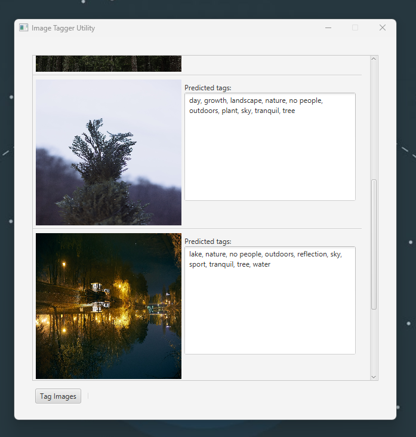

# Image Tagger

Image Tagger is a simple software application for predicting an image's keywords using a deep learning model based on resnet.

It allows photographers to automate the image tagging process. 📸

---

## Instructions

This tool is not that user-friendly yet, but I'm working on an alternative version that will be more user-friendly.

I've implemented the graphical user interface in ~2 hours while having minimal experience with Java GUI frameworks.

To use this tool follow these steps:

1. Download JRE 20.2 or higher from [here](https://www.oracle.com/java/technologies/downloads/#java20)
2. Download the program JAR file and model from GitHub, [here](#todo).
3. Run the program JAR file using the following command (you will need to open the command line): `java -jar ImageTagger.jar`
4. Click "Load Model" and select the model file you downloaded: `resnet50_10_epochs.onnx`
5. Click "Choose Image" and select the image you want to tag.
6. Wait for the prediction to finish.
7. You will get the keywords in the text field, and you can copy them to the clipboard.

Thank you for using my tool! 🙏

You can visit my blog at [https://blog.nuculabs.dev](https://blog.nuculabs.dev).